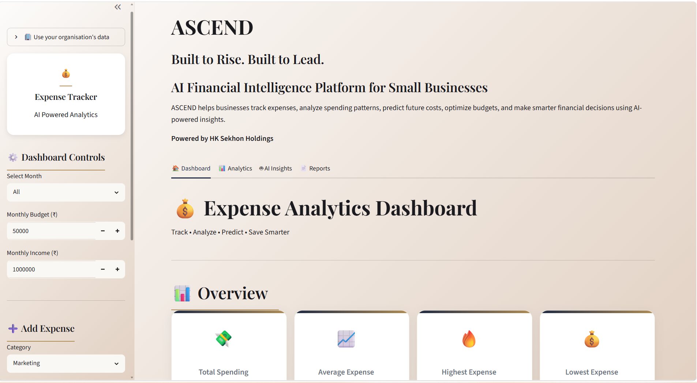

# ASCEND

### AI-Powered Financial Intelligence Platform for Businesses

ASCEND is an AI-powered financial intelligence platform designed to help businesses understand spending, monitor financial performance, predict future expenses, optimize budgets, and make data-driven financial decisions.

Built with **Python, Streamlit, SQLite, Pandas, Scikit-learn, and AI-driven analytics**, ASCEND combines financial tracking with predictive analytics and intelligent recommendations in a unified dashboard.

## 📊 Dashboard Preview



---

## 🚀 Key Capabilities

### 💳 Financial Management

* Add, edit, and delete financial transactions
* Search and filter expense records
* Category-based expense organization
* Income and savings tracking
* Budget monitoring
* Savings goal tracking

### 📊 Analytics & Visualization

* Spending analysis
* Category-wise financial breakdown
* Monthly spending trends
* Financial performance metrics
* Interactive visualizations
* Expense distribution analysis


### 🤖 AI-Powered Intelligence

* Future spending prediction using machine learning
* Financial risk assessment
* AI-generated financial insights
* Smart budget recommendations
* Suggested savings targets
* Spending behavior analysis
* Anomaly detection


### 📄 Reporting

* Automated financial reports
* Category-based reporting
* PDF report generation
* Data export capabilities


---

## 🧠 Machine Learning

ASCEND uses machine learning to analyze historical spending patterns and estimate future financial behavior.

The analytics pipeline includes:

```text
Financial Data
      ↓
Data Processing
      ↓
Expense Analysis
      ↓
Feature Extraction
      ↓
Machine Learning Model
      ↓
Spending Prediction
      ↓
AI Financial Intelligence
      ↓
Recommendations
```

---

## 🏗️ System Architecture

```text
                    ASCEND
                       │
        ┌──────────────┼──────────────┐
        │              │              │
   Data Layer     Analytics Layer   AI Layer
        │              │              │
     SQLite       Visualization    Predictions
     JSON         Trends           Risk Analysis
     CSV          Categories       Recommendations
        │              │              │
        └──────────────┼──────────────┘
                       │
                Streamlit Dashboard
                       │
        ┌──────────────┼──────────────┐
        │              │              │
    Dashboard      Analytics      AI Insights
        │              │              │
        └──────────────┼──────────────┘
                       │
                    Reports
```

---

## 🛠️ Technology Stack

| Technology   | Purpose                         |
| ------------ | ------------------------------- |
| Python       | Core application development    |
| Streamlit    | Interactive web application     |
| SQLite       | Local financial data storage    |
| Pandas       | Data processing and analysis    |
| Scikit-learn | Machine learning and prediction |
| Matplotlib   | Data visualization              |
| ReportLab    | PDF report generation           |
| CSS          | Dashboard styling               |
| Git & GitHub | Version control                 |

---

## 📁 Project Structure

```text
ASCEND/
│
├── analytics/
├── assets/
├── charts/
├── components/
├── data/
├── database/
├── utils/
│
├── ai_engine.py
├── ai_tab.py
├── app.py
├── config.py
├── requirements.txt
├── seed.py
├── style.css
├── expenses.json
│
├── .gitignore
└── README.md
```

---

## ⚙️ Installation

### 1. Clone the repository

```bash
git clone https://github.com/Jasleen-kaur13/ASCEND.git
cd ASCEND
```

### 2. Create a virtual environment

```bash
python -m venv venv
```

### 3. Activate the environment

**Windows:**

```bash
venv\Scripts\activate
```

### 4. Install dependencies

```bash
pip install -r requirements.txt
```

### 5. Run ASCEND

```bash
streamlit run app.py
```

The application will open in your browser.

---

## 🔐 Security

Sensitive credentials are intentionally excluded from version control.

The repository uses `.gitignore` to prevent files such as:

```text
.env
*.db
.streamlit/secrets.toml
__pycache__/
```

from being committed to the public repository.

---

## 📈 Project Vision

ASCEND is designed as a foundation for a broader financial intelligence platform.

The long-term vision is to evolve from expense tracking into an intelligent financial decision-support system capable of helping businesses:

* understand financial behavior
* identify financial risks
* forecast future spending
* optimize budgets
* improve savings
* support data-driven decision making

---

## 👩‍💻 Author

**Jasleen Kaur**

B.Tech — Artificial Intelligence & Machine Learning

GitHub:
https://github.com/Jasleen-kaur13

---

## ⭐ Project Status

**Active Development**

ASCEND is continuously being improved with a focus on:

* AI-powered financial intelligence
* predictive analytics
* enterprise-grade UX
* scalable architecture
* reliable financial reporting

---

## 📜 License

License information will be added as the project matures.
